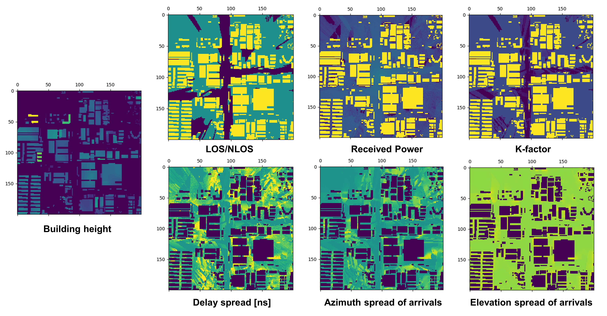
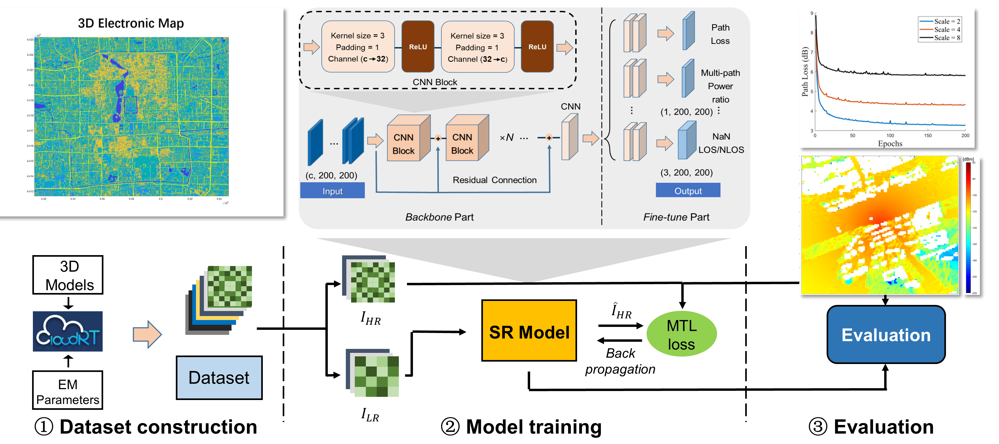
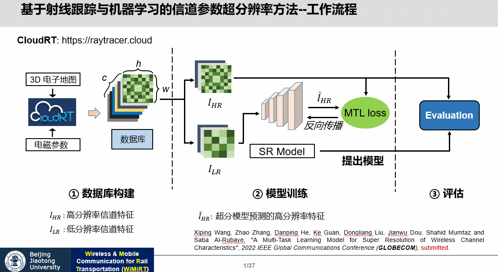

# Super Resolution method for large-scale characteristics

## Background
### Present
Traditional approaches like stochastic channel modeling and ray-tracing (RT) based channel modeling depend heavily on measurement data or simulation, 
which are usually expensive and time-consuming. In this paper, we propose a novel super resolution (SR) model for generating channel characteristics data.
The model is based on multi-task learning (MTL) convolutional neural networks (CNN) with residual connection. Experiments demonstrate that the proposed 
SR model could achieve excellent performances in mean absolute error and standard deviation of error. 
The advantages of the proposed model are demonstrated in comparisons with other state-of-the-art deep learning models. 
The ablation study also proved the necessity of multi-task learning and techniques in model design. 
Using [ray tracing](http://raytracer.cloud) and electronic maps of each city, we conducted simulations in dense urban areas. We extracted the following large-scale channel parameters, including path loss, delay spread, Rice factor, azimuth angular spread of arrival, zenith angular spread of arrival and LOS area identification.


### Our contribution

In dense urban areas, RT simulation by self-developed CloudRT was conducted and channel characteristics datasets are constructed based on simulation results.
A residual network based MTL SR model is proposed. Weighted masks are added in the loss function. Homoscedic uncertainty is employed to balance the single-task losses during training. Residual connection and iterative up-and-down techniques are implemented in CNN blocks for better SR performances.
The training process and results of the evaluation are provided. The proposed SR approach generally performs better than other state-of-the-art DL models. 
Comparing with baseline, the proposed approach could achieve very good SR results in all channel characteristics targets and deteriorate significantly less 
than baseline with larger scale factor. Ablation study proved that the techniques in training and model design are necessary.



## Usage
Users can download the code above, we especially recommend downloading zip to develop the project.

You can train the model with the following command statement.

```
python mlt_main.py
```

## Dataset
Workers can use [CloudRT](http://cn.raytracer.cloud:9090/) to build your own Channel Characteristics dataset.

**Note**: If you would like to obtain **a** **well-built dataset**, please contact us by email. Our contact email is `zhaozhang@bjtu.edu.cn`

## Contributing
### Contributors
This project exists thanks to all the people who contribute.

## Article
[A Multi - Task Learning Model for Super Resolution of Wireless Channel Characteristics](https://ieeexplore.ieee.org/abstract/document/10001700)
